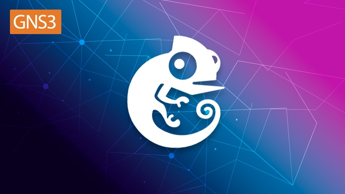

GNS3 and How to Install and Configure Cisco LAB?

GNS3 (Graphical Network Simulator-3) is a network simulation software that allows you to design complex network topologies and simulate them on your computer. It's commonly used for testing and learning networking concepts. GNS3 doesn't include actual networking hardware but emulates the behavior of network devices using software.

Cisco IOS (Internetwork Operating System) is the operating system that runs on most Cisco networking devices, including routers and switches. It provides the core functionality for routing, switching, and various networking protocols. In the context of GNS3, Cisco IOS images are used to simulate the behavior of Cisco devices within the software.

VIRL (Virtual Internet Routing Lab) is a Cisco product that provides a scalable and extensible network design and simulation environment. It allows users to run and test multiple virtualized network devices. VIRL uses Cisco's own virtualization technology and includes a variety of Cisco images.

When using GNS3, you often need Cisco IOS images to simulate the features and functionalities of Cisco devices. However, obtaining Cisco IOS images legally involves having a valid Cisco support contract or purchasing the necessary licenses.

More Information >> GNS3 Course >> https://www.udemy.com/course/gns3-cisco-ios-virl-network-administration-ccna-lab-part-1

****************************************
GNS3 Linux Installation

Ubuntu-based distributions (64-bit only) Example:

sudo apt update

sudo add-apt-repository ppa:gns3/ppa

sudo apt update

sudo apt install gns3-gui gns3-server

sudo usermod -aG ubridge,libvirt,kvm $(whoami)

sudo chmod 755 /usr/bin/ubridge

More Information:

https://docs.gns3.com/docs/getting-started/installation/linux

For Wireshark:

sudo usermod -aG ubridge,libvirt,kvm,wireshark $(whoami)

