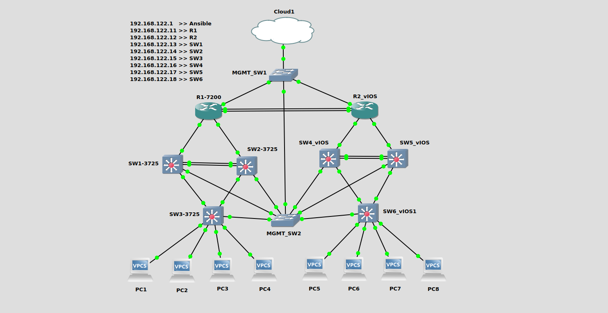

Basic Cisco Router and Switch Verification with Ansible - GNS3 Cisco Routing & Switching Lab


**Linux Commands**
```bash

sudo apt update -y

sudo apt install git -y

cd $home

git clone https://github.com/nimaxnimax/Udemy_Net_Infra_Automation_Ansible_Cisco_GNS3.git

cd Udemy_Net_Infra_Automation_Ansible_Cisco_GNS3/Part_1/Chapter_04

git pull

ls -anp

ifconfig

arp

ip addr

ping 192.168.122.11

ssh -oHostKeyAlgorithms=ssh-rsa ansible@192.168.122.11

rm -f /home/nima/.ssh/known_hosts

cat /etc/hosts

sudo vi /etc/hosts

ping r1

ping sw1

ls -anp

cat ansible_hosts

cat secrets.yml

ls -anp | grep yml

ansible-playbook -i ansible_hosts interface_ip.yml

ansible-playbook -i ansible_hosts arp.yml

ansible-playbook -i ansible_hosts cdp.yml

ansible-playbook -i ansible_hosts if_desc.yml

ansible-playbook -i ansible_hosts uptime.yml

ansible-playbook -i ansible_hosts if_up.yml

ansible-playbook -i ansible_hosts mtu.yml

```

**********
Here are some basic cisco router or switch verification commands that you can use to check the status and configuration of your router and switch:

1. **Show Interfaces:**
   ```
   show interfaces
   ```

   This command displays the status and statistics for all interfaces on the router.

2. **Show IP Interface Brief:**
   ```
   show ip interface brief
   ```

   This command provides a brief summary of the status and configuration of all interfaces, along with their IP addresses.

3. **Show Running-Config:**
   ```
   show running-config
   ```

   This command displays the current running configuration of the router. You can use this to view the entire configuration, including interfaces, routing protocols, and more.

4. **Show Version:**
   ```
   show version
   ```

   This command provides information about the router hardware, software version, and the configuration register.

5. **Show IP Route:**
   ```
   show ip route
   ```

   This command displays the routing table, showing the current routing information and how the router will forward packets.

6. **Show ARP:**
   ```
   show arp
   ```

   This command shows the ARP (Address Resolution Protocol) table, displaying the mapping between IP addresses and MAC addresses.

7. **Show CDP Neighbors:**
   ```
   show cdp neighbors
   ```

   If Cisco Discovery Protocol (CDP) is enabled, this command displays information about directly connected Cisco devices.

8. **Show Interfaces Status:**
   ```
   show interfaces status
   ```

   This command provides a summary of the status and connectivity of all interfaces, including information on whether they are up or down.

9. **Show IP Protocols:**
   ```
   show ip protocols
   ```

   This command displays information about routing protocols running on the router, including their status and configuration.

10. **Show Access-Lists:**
    ```
    show access-lists
    ```

    This command shows the configured access lists on the router, including their rules and hit counts.

Remember that the specific commands and their output may vary depending on the router model and the IOS (Internetwork Operating System) version running on the device. Additionally, some commands may require privileged EXEC mode, which you can enter using the `enable` command.

Here are some additional cisco router or switch verification commands:

11. **Show Interface [interface type and number]:**
    ```
    show interface <interface-type>/<interface-number>
    ```

    This command provides detailed information about a specific interface, including its status, configuration, and traffic statistics.

12. **Show Controllers [interface type and number]:**
    ```
    show controllers <interface-type>/<interface-number>
    ```

    This command displays information about the physical layer characteristics and statistics for a specific interface.

13. **Show IP Interface [interface type and number]:**
    ```
    show ip interface <interface-type>/<interface-number>
    ```

    This command shows detailed information about a specific IP interface, including its IP address, subnet mask, and protocol status.

14. **Show IP Route [specific network or destination]:**
    ```
    show ip route <network or destination>
    ```

    Use this command to display the routing table for a specific network or destination.

15. **Show IP EIGRP [AS number] Topology:**
    ```
    show ip eigrp topology
    ```

    If EIGRP (Enhanced Interior Gateway Routing Protocol) is running, this command displays the EIGRP routing topology.

16. **Show IP OSPF Neighbor:**
    ```
    show ip ospf neighbor
    ```

    This command displays information about OSPF (Open Shortest Path First) neighbors and their status.

17. **Show VLAN:**
    ```
    show vlan
    ```

    This command shows information about VLANs configured on the router.

18. **Show Logging:**
    ```
    show logging
    ```

    This command displays the router's logging configuration and recent log messages.

19. **Show IP NAT Translations:**
    ```
    show ip nat translations
    ```

    If Network Address Translation (NAT) is configured, this command displays the active NAT translations.

20. **Show Crypto Isakmp SA:**
    ```
    show crypto isakmp sa
    ```

    This command displays the Internet Security Association and Key Management Protocol (ISAKMP) Security Associations (SAs) on the router.

Remember to replace `<interface-type>/<interface-number>` and `<network or destination>` with the specific interface type and number or network/destination you are interested in.

