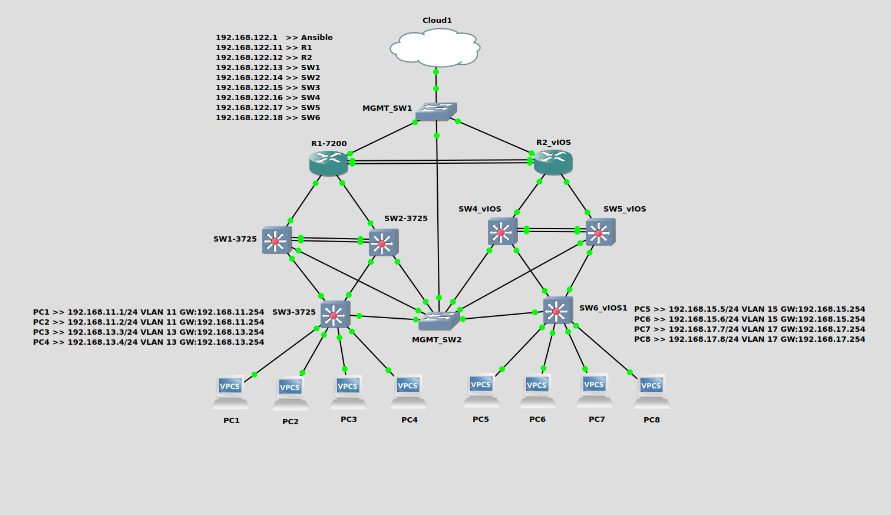

Udemy Course >> Network Infrastructure Automation with Ansible + Cisco (CCT/CCNA) GNS3 Part 2

**********

Ansible Automation YAML Network Administration Cisco Infrastructure Deployment Programming Engineering GNS3 CCT CCNA P2

**********

Topics:
- Review Ansible Installation and Configuration
- GNS3 and How to Install and Configure Routers and Switches for Cisco Ansible Lab?
- Review Configuring Cisco Routers & Switches for Basic Connectivity (Console/Telnet) and Cisco IOS Automation with Ansible
- Cisco Router & Switch Verification with Ansible (GNS3 Cisco Routing & Switching Lab)
- Cisco Router & Switch SSH Configuration with Ansible
- How to Check MAC Address-Table on Switches with Ansible?
- How to Change Hostname on Routers/Switches with Ansible?
- How to Check Interfaces on Routers/Switches with Ansible?
- How to Check Interface Speed Duplex with Ansible?
- How to Check Running-Config & Startup-Config and Save Configs with Ansible?
- How to Check Errors and CRC on Routers/Switches with Ansible?
- How to Change Passwords on Routers/Switches with Ansible?
- How to Config VLANs on vIOS L2 Switches and Verify with Ansible?
- How to Config VLANs on 3725/3745 Ether Switches and Verify with Ansible?
- How to Config SVI Interface VLANs on vIOS & 3725/3745 MLS Switches and Verify with Ansible?
- How to Configure Routing on MLS Switches and Check Routing Table and ARP with Ansible?
- How to Check CDP and IP Addresses on Routers/Switches with Ansible?
- How to Configure Access Ports on L2 Switches with Ansible?
- How to Configure Default Gateway on L2 Switches with Ansible?
- How to Change Speed and Duplex Config on Routers and Switches with Ansible?
- How to Check Connectivity in the Network on Routers/Switches with Ansible?
- How to Configure Static Routing with Ansible?

**********

Tips/Tricks/Notes/Commands URL Link: https://github.com/nimaxnimax/Udemy_Net_Infra_Automation_Ansible_Cisco_GNS3/tree/main/Part_2

Instructor & Courses >> https://www.udemy.com/user/adrian-fischer-infotech/

**********

Review Ansible Installation and Configuration + Git Repository

```bash
sudo apt update -y
sudo apt install ansible -y
ansible --version
sudo apt install git -y
git clone https://github.com/nimaxnimax/Udemy_Net_Infra_Automation_Ansible_Cisco_GNS3.git
```

**********

GNS3 and How to Install and Configure Routers and Switches for Cisco Ansible Lab? And Play a YAML File

```bash
cd Udemy_Net_Infra_Automation_Ansible_Cisco_GNS3/Part_2
ls -anp
cat ansible_hosts
cat secrets.yml
cat /etc/hosts
ansible-playbook -i ansible_hosts arp.yml
```

**********

Review Configuring Cisco Routers & Switches for Basic Connectivity (Console/Telnet) and Cisco IOS Automation with Ansible

```bash
ansible-playbook -i ansible_hosts telnet_ssh_timeout_config.yml 
ansible-playbook -i ansible_hosts telnet_console_username_password_config.yml 
ansible-playbook -i ansible_hosts telnet_ssh_timeout_check.yml 
```

**********

Cisco Router & Switch Verification with Ansible (GNS3 Cisco Routing & Switching Lab)

```bash
ansible-playbook -i ansible_hosts version_check.yml
ansible-playbook -i ansible_hosts version_interface.yml 
ansible-playbook -i ansible_hosts version_uptime.yml 
ansible-playbook -i ansible_hosts version_memory.yml 
ansible-playbook -i ansible_hosts version_ios.yml 
ansible-playbook -i ansible_hosts version_check.yml
```

**********

Cisco Router & Switch SSH Configuration with Ansible

```bash
ansible-playbook -i ansible_hosts ssh_config.yml 
ssh-keygen -f "/home/adrian/.ssh/known_hosts" -R "sw1"
ssh -oHostKeyAlgorithms=ssh-rsa ansible@sw1
```

**********

How to Check MAC Address-Table on Switches with Ansible?

```bash
ansible-playbook -i ansible_hosts mac_address_table_3725_check.yml 
ansible-playbook -i ansible_hosts mac_address_table_3725_check_count.yml 
ansible-playbook -i ansible_hosts mac_address_table_vios_check.yml 
ansible-playbook -i ansible_hosts mac_address_table_vios_check_count.yml 
```

**********

How to Change Hostname on Routers/Switches with Ansible?

```bash
ansible-playbook -i ansible_hosts hostname_config_and_check.yml
```

**********

How to Check Interfaces on Routers/Switches with Ansible?

```bash
ansible-playbook -i ansible_hosts if_desc.yml
ansible-playbook -i ansible_hosts if_up.yml
ansible-playbook -i ansible_hosts interface_ip.yml
```

**********

How to Check Interface Speed Duplex with Ansible?

```bash
ansible-playbook -i ansible_hosts interface_speed_duplex_run_config.yml
ansible-playbook -i ansible_hosts interface_speed_duplex.yml
```

**********

How to Check Errors and CRC on Routers/Switches with Ansible?

```bash
ansible-playbook -i ansible_hosts interface_CRC.yml
```

**********

How to Change Passwords on Routers/Switches with Ansible?

```bash
ansible-playbook -i ansible_hosts username_password_enable_secret.yml
```

**********

How to Config VLANs on vIOS L2 Switches and Verify with Ansible?

```bash
ansible-playbook -i ansible_hosts vlan_config_vios_switch.yml
ansible-playbook -i ansible_hosts vlan_checking_vios.yml
```

**********

How to Config VLANs on 3725/3745 Ether Switches and Verify with Ansible?

```bash

```

**********

How to Config SVI Interface VLANs on vIOS & 3725/3745 MLS Switches and Verify with Ansible?

```bash

```

**********

How to Configure Routing on MLS Switches and Check Routing Table and ARP with Ansible?

```bash

```

**********

How to Check CDP and IP Addresses on Routers/Switches with Ansible?

```bash

```

**********

How to Configure Access Ports on L2 Switches with Ansible?

```bash

```

**********

How to Configure Default Gateway on L2 Switches with Ansible?

```bash

```

**********

How to Change Speed and Duplex Config on Routers and Switches with Ansible?

```bash

```

**********

How to Check Connectivity in the Network on Routers/Switches with Ansible?

```bash

```

**********

How to Configure Static Routing with Ansible?

```bash

```

**********

